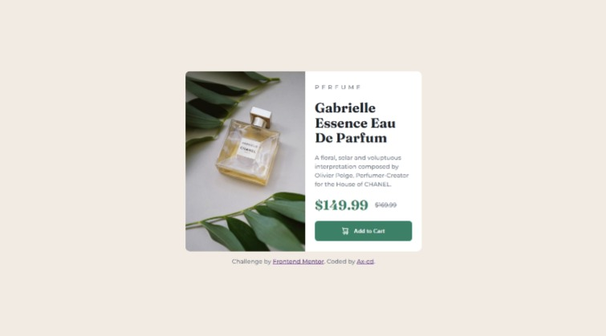

# Frontend Mentor - Product preview card component solution

This is a solution to the [Product preview card component challenge on Frontend Mentor](https://www.frontendmentor.io/challenges/product-preview-card-component-GO7UmttRfa). Frontend Mentor challenges help you improve your coding skills by building realistic projects.

## Table of contents

- [Overview](#overview)
  - [The challenge](#the-challenge)
  - [Links](#links)
  - [Screenshot](#screenshot)
    - [Mobile design](#mobile-design)
    - [Desktop design](#desktop-design)
- [My process](#my-process)
  - [Built with](#built-with)
  - [What I learned](#what-i-learned)
  - [Useful resources](#useful-resources)
- [Author](#author)

## Overview

### The challenge

Users should be able to:

- View the optimal layout depending on their device's screen size
- See hover and focus states for interactive elements

### Links

- Solution URL: [Frontend Mentor](https://your-solution-url.com)
- Live Site URL: [GitHub Page](https://ax-cd.github.io/product-preview-card-challenge/)

### Screenshot

#### Mobile design


#### Desktop design



## My process

### Built with

- Semantic HTML5 markup
- CSS custom properties
- Flexbox
- Mobile-first workflow

### What I learned

I learned how to write conditional CSS for the border-radius.

```css
.card-img {
  border-top-left-radius: 10px;
  border-top-right-radius: max(
    0px,
    min(10px, calc((425px - 4px - 100%) * 9999))
  );
}
```

### Useful resources

- ["Conditional Border Radius In CSS" by Ahmad Shadeed](https://ishadeed.com/article/conditional-border-radius/) - This article made me discover and understand how to change a border-radius based on viewport width.

## Author

- GitHub - [Ax-cd](https://github.com/Ax-cd)
- Frontend Mentor - [@Ax-cd](https://www.frontendmentor.io/profile/Ax-cd)
- Instagram - [@ax.coding](https://www.instagram.com/ax.coding/)
